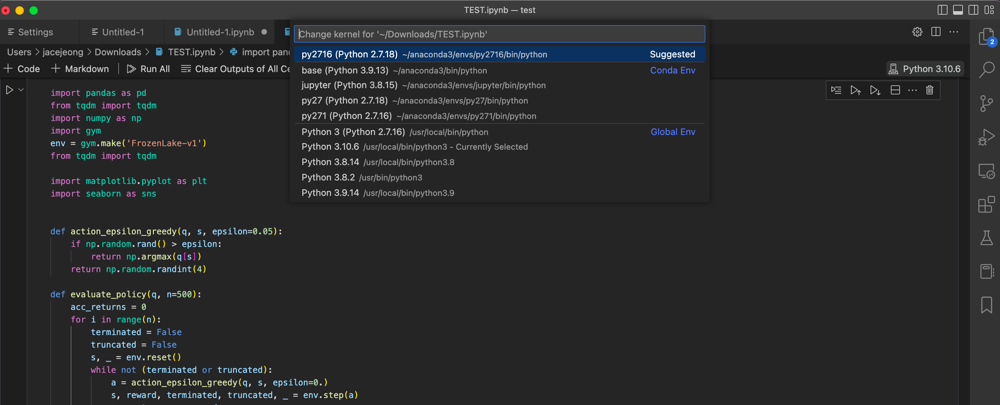

# 강화학습



# 실행 환경

- 권장 : Microsoft Code 에 Jupyter notebook 플러그인 설치 권장, 커널은 anaconda 를 이용해서 활용

# 실행방법

- anaconda

```python
* 각 버전 설치 
conda create -n py2716  python=2.7.16
conda create -n py3106  python=3.10.6

* 버전별 명령어를 이용한 환경 이동 
conda activate py2716
conda activate py3106

* 환경 나오기 
conda deactivate py2716
conda deactivate py3106
```

- local 에 버전 두개 설치 해서 활용

- 주피터 노트북과 MS Code 사용
    - 주피터 노트북 파일 생성
        - 코드 복사 & 붙여넣기
        - 실행
    - 커널 : python 2.7.16 (화면 오른쪽 상단 : 사전에 해당 버전 설치 필요)
        - rl_1.py, rl_1.py, rl_1.py 실행 할 때는 2.7.16 버전으로 실행.
    - 커널 : python 3.10.6 (화면 오른쪽 상단 : 사전에 해당 버전 설치 필요)
        - rl_4_salsa.py, rl_5_qlearning.py 실행 할 때는 3.10.6 버전으로 실행.

# 환경 및 데이터셋 설명

- 환경 : frozen- lake

4x4 grid where each cell is either a starting cell (S), a frozen cell (F) indicating a safe position, a hole (H) which must be avoided, or the goal (G) which must be reached. Any agent starts at S and needs to find its way to G via F avoiding H. The agent’s actions result in deterministic transitions and work as intended. The reward is 1 if you reach G and 0 otherwise.

참고 : [https://medium.com/swlh/frozen-lake-as-a-markov-decision-process-1692815ecfd1](https://medium.com/swlh/frozen-lake-as-a-markov-decision-process-1692815ecfd1)

- 그 외 강화학습 환경
    - anaconda 사용
        - python 2.7.16
        - python 3.10.6
    - IDE : Code 에 jupyter notebook 플러그인 설치 해서 사용

# State, action, reward 설계 설명

## State

The observation is a value representing the agent’s current position as current_row * nrows + current_col (where both the row and col start at 0). For example, the goal position in the 4x4 map can be calculated as follows: 3 * 4 + 3 = 15. The number of possible observations is dependent on the size of the map. For example, the 4x4 map has 16 possible observations.

## **Action Space**

The agent takes a 1-element vector for actions. The action space is `(dir)`, where `dir` decides direction to move in which can be:

- 0: LEFT
- 1: DOWN
- 2: RIGHT
- 3: UP

## **Rewards**

Reward schedule:

- Reach goal(G): +1
- Reach hole(H): 0
- Reach frozen(F): 0
